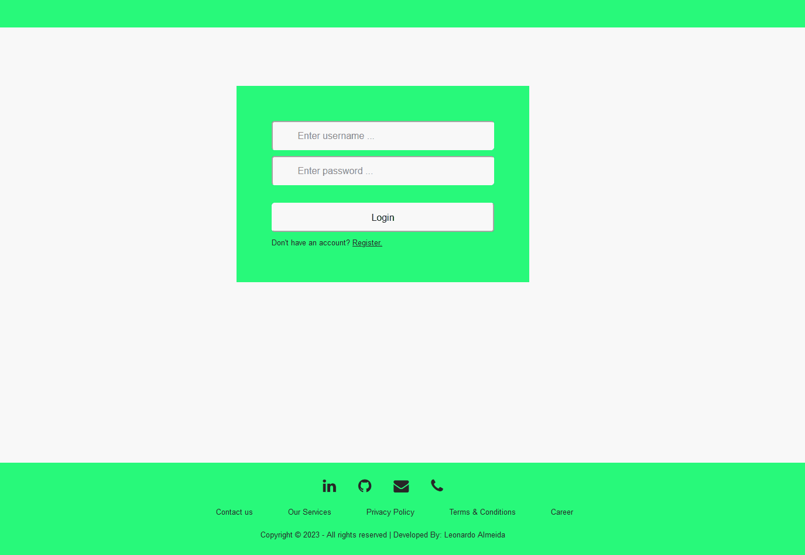

# Trampay App

This is a React.js application where you can Register and Login as a User. Once logged in, you can upload a CSV file containing data regarding clients, such as identification, balance and date of upload. This App can be tested
along with this [API](https://github.com/leonardo-alm/API--Trampay) 

## Demo

To see the demo in higher quality click on the gif below.

## Run

Run 'npm start' to run the app.

Open [http://localhost:3001](http://localhost:3001) to view it in the browser.